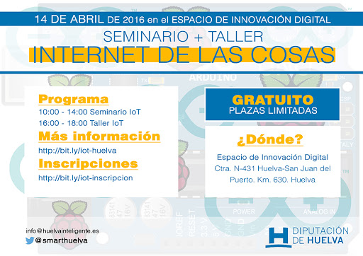

# Seminario de IOT en Huelva

## Sobre la charla

> ¿Qué aprenderá? En este seminario, de 10:00 a 14:00, veremos, partiendo de una base sencilla en la que no es necesario tener conocimiento previo; qué es el IoT, el alcance, así como su potencialidad y proyección. Una charla "in crescendo" de la mano de Ulises Gascón, que culminará en horario de tarde, de 16:00 a 18:00, con el Taller IoT, en el que se proporcionará un Kit de Arduino para cada grupo y se realizarán prácticas introductorias cuyo objetivo será el acercamiento al IoT de primera mano.

## Videos

- [Diputación Provincial de Huelva | Seminario El internet de las Cosas](https://www.youtube.com/watch?v=n0AzLrU0Qhg)
- [S27 - Internet de las Cosas - Parte I - EID](https://www.youtube.com/watch?v=p935-uqRuN0&t)
- [S27 - S28 - Internet de las Cosas - Parte II - EID](https://www.youtube.com/watch?v=tjvuc0Xfzlc)

## Presentaciones

- [Parte 1](https://ulisesgascon.github.io/slides-seminario-iot-huelva-inteligente)
- [Parte 2](https://ulisesgascon.github.io/slides-seminario-iot-huelva-inteligente-parte-2/)
- [Workshop](https://ulisesgascon.github.io/seminario-IOT-Huelva-Inteligente-workshop/)

## Prensa

- [Diputación de huelva | La Diputación organiza para el próximo jueves un seminario-taller sobre el Internet de las cosas](http://control.diphuelva.es/pdflink/es/d1086e0d-0a72-11e8-abc7-63f9a58dae09/La-Diputacion-organiza-para-el-proximo-jueves-un-seminario-taller-sobre-el-Internet-de-las-cosas.pdf?themeconfigpath=/sites/dph/.themeconfig)
- [Diputación de huelva | Sala de prensa | La Diputación organiza para el próximo jueves un seminario-taller sobre el Internet de las cosas](http://www.diphuelva.es/prensa/La-Diputacion-organiza-para-el-proximo-jueves-un-seminario-taller-sobre-el-Internet-de-las-cosas/)
- [Diario de Huelva | La robotización del mundo o el ‘Internet de las cosas’, en un seminario-taller](https://www.diariodehuelva.es/2016/04/11/la-robotizacion-del-mundo-o-el-internet-de-las-cosas-en-un-seminario-taller/)
- [Huelva buenas noticias | Más de 70 alumnos asisten al seminario-taller sobre Internet de las Cosas](https://huelvabuenasnoticias.com/2016/04/14/mas-de-70-alumnos-asisten-al-seminario-taller-sobre-internet-de-las-cosas/)
- [Heconomia.es | La Diputación organiza para el próximo jueves un seminario-taller sobre el Internet de las cosas](http://www.heconomia.es/volatil.asp?o=-154314853)
- [Huelva Inteligente | Seminario Internet de las Cosas (IoT) (Web Archive)](https://web.archive.org/web/20160503160244/http://blog.huelvainteligente.es/noticias/internet-de-las-cosas-iot/)
- [Huelva Inteligente | Entrevista a Ulises Gascon (Web Archive)](https://web.archive.org/web/20160704143330/http://blog.huelvainteligente.es/noticias/entrevistamos-a-ulises-gascon-y-hablamos-sobre-internet-de-las-cosas/)

## Recursos

- [Arduino The Documentary (2010) Spanish HD](https://vimeo.com/18390711)
- [Comparativa entre las muchas variantes de Arduino](https://www.arduino-board.com/)
- [How the Internet Works in 5 Minutes](https://www.youtube.com/watch?v=7_LPdttKXPc)
- [History of the Internet](https://www.youtube.com/watch?v=9hIQjrMHTv4)
- [thingiverse (comunidad de modelos para impresión 3D)](http://www.thingiverse.com/)
- [Meet the Makers: Limor Fried of Adafruit Industries](https://www.youtube.com/watch?v=_6EReqtFR0Y)
- [What is Open Source explained in LEGO](https://www.youtube.com/watch?v=a8fHgx9mE5U)
- [Gracias a él se publica la cuarta parte de las webs del mundo: Matt Mullenweg, fundador de WordPress](http://one.elpais.com/gracias-a-el-se-publica-la-cuarta-parte-de-las-webs-del-mundo-matt-mullenweg-fundador-de-wordpress/)
- [Jimmy Wales, fundador de la Wikipedia, en su 15º aniversario: “No es cierto que hayamos hecho a los alumnos más vagos”](http://one.elpais.com/jimmy-wales-fundador-de-la-wikipedia-en-su-15o-aniversario-no-es-cierto-que-hayamos-hecho-a-los-alumnos-mas-vagos/)
- [CartoDB: los mapas españoles que servirán para cambiar el mundo](http://one.elpais.com/cartodb-los-mapas-espanoles-que-serviran-para-cambiar-el-mundo/)
- [WHY DO OPEN HARDWARE? - Limor Fried @ Open Hardware Summit](https://www.youtube.com/watch?v=UYRhupdnUcY&ebc=ANyPxKpyILkrNI5MdRXaE7TYWm_PF8huAWuB8UmfRqHBJKy5sWbFQ1QXoEhDOPdtFvGhb4ba_zRPWbmHVjqj6bbgyoBcP7gTzQ)
- [El diminuto ordenador de menos de 30 euros capaz de conectarlo todo: así es Raspberry Pi](http://one.elpais.com/diminuto-ordenador-menos-30-euros-capaz-conectarlo-asi-raspberry-pi/)
- [Yo, Maker: Juan Gonzalez "Objiuan" at TEDxValladolid](https://www.youtube.com/watch?v=94_uaafCR0w)
- [Tan Le te muestra cómo ya es posible manejar tus dispositivos directamente desde tu cerebro](http://one.elpais.com/tan-le-te-muestra-como-ya-es-posible-manejar-tus-dispositivos-directamente-desde-tu-cerebro/)
- [Peter Diamandis, presidente de XPrize: el hombre que quiere arreglar los mayores problemas del mundo](http://one.elpais.com/peter-diamandis-presidente-de-xprize-el-hombre-que-quiere-arreglar-los-mayores-problemas-del-mundo/)
- [Ben Hammersley, editor de ‘Wired’ en Reino Unido, te explica cómo afrontar las nuevas tecnologías sin traumas](http://one.elpais.com/ben-hammersley-editor-de-wired-en-reino-unido-te-explica-como-afrontar-las-nuevas-tecnologias-sin-traumas/)
- [Carreras de drones: arranca la liga mundial del deporte del futuro](http://one.elpais.com/carreras-de-drones-arranca-la-liga-mundial-del-deporte-del-futuro/)
- [En unos años los robots estarán embebidos en todos nuestros aparatos cotidianos](http://one.elpais.com/en-unos-anos-los-robots-estaran-embebidos-en-todos-nuestros-aparatos-cotidianos/)
- [¿Podrá Internet oír, tocar y ver a través de sensores David Gascón responde](https://www.youtube.com/watch?v=kAjh3j_Mtfo)
- [Maravillosos avances de la biónica: prótesis perfectas capaces de simular el movimiento de nuestros miembros](http://one.elpais.com/maravillosos-avances-de-la-bionica-protesis-perfectas-capaces-de-simular-el-movimiento-de-nuestros-miembros/)
- [E-nable - enablingthefuture.org](http://enablingthefuture.org/)
- [Neil Harbisson: músico, artista y primer cíborg reconocido legalmente por un gobierno](http://one.elpais.com/neil-harbisson-musico-artista-y-primer-ciborg-reconocido-legalmente-por-un-gobierno/)
- [e-NABLING Families • 3D Printed Prosthetic Hands](https://www.youtube.com/watch?v=shFps8PRFbM)
- [Mitchel Resnick, del MIT, te presenta Scratch, el lenguaje de programación con el que tu hijo cambiará el mundo](http://one.elpais.com/mitchel-resnick-del-mit-te-presenta-scratch-el-lenguaje-de-programacion-con-el-que-tu-hijo-cambiara-el-mundo/)
- [Jay Silver, el “McGyver” de las nuevas tecnologías: el doctor del MIT capaz de usar un ordenador con un trozo de pizza](http://one.elpais.com/jay-silver-el-mcgyver-de-las-nuevas-tecnologias-el-doctor-del-mit-capaz-de-usar-un-ordenador-con-un-trozo-de-pizza/)
- [Kano, el ordenador que puede ser construido y programado por un niño de siete años](http://one.elpais.com/kano-el-ordenador-que-puede-ser-construido-y-programado-por-un-nino-de-siete-anos/)
- [Linda Franco te presenta la ropa conectada: una chaqueta con la que puedes hacer música o controlar un dron](http://one.elpais.com/linda-franco-te-presenta-la-ropa-conectada-una-chaqueta-con-la-que-puedes-hacer-musica-o-controlar-un-dron/)
- [Así son las prótesis ‘low cost’: descargables de Internet y listas para imprimir en 3D por menos de 20 euros](http://one.elpais.com/asi-son-las-protesis-low-cost-descargables-de-internet-y-listas-para-imprimir-en-3d-por-menos-de-20-euros/)
